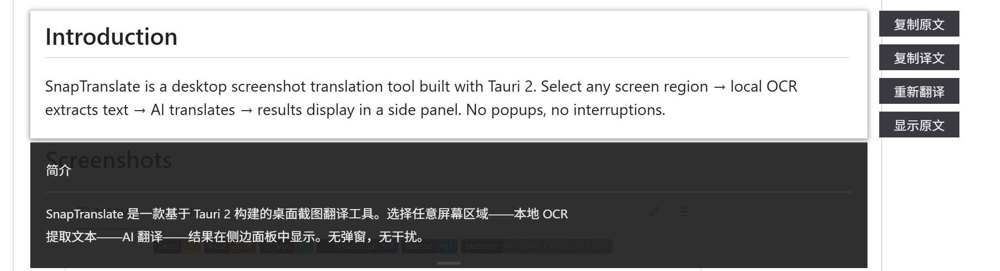

<h1 align="center">SnapTranslate</h1>

<p align="center">
  
</p>

<p align="center">
  
  
  
  
  
  
</p>

<p align="center">
  <a href="README.zh.md">简体中文</a> · <a href="README.zh-TW.md">繁體中文</a> · <a href="README.md">English</a> · <a href="README.ja.md">日本語</a> · <a href="README.ko.md">한국어</a>
</p>

## Introduction

SnapTranslate is a desktop screenshot translation tool built with Tauri 2. Select any screen region → local OCR extracts text → AI translates → results display in a side panel. No popups, no interruptions.

## Screenshots

<p align="center">
  
</p>

## Download

Download from [Releases](https://github.com/XuMingKe-06/SanpTranslate/releases):

| Platform | Format |
|----------|--------|
| Windows 10+ | `.exe` |
| macOS 12+ | `.dmg` |
| Linux (x86_64) | `.AppImage` |

⚠️ **System Requirements:**

- **Windows**: Windows 10 (1803+), WebView2 (built into the system)
- **macOS**: macOS 12+, WebKit (built into the system). Requires Tesseract and language data installed via Homebrew:
  ```bash
  brew install tesseract tesseract-lang
  ```
- **Linux**: X11/Wayland support, WebKitGTK required. Requires Tesseract OCR engine and corresponding language packs:
  - **Ubuntu / Debian**:
    ```bash
    sudo apt update
    sudo apt install tesseract-ocr tesseract-ocr-chi-sim tesseract-ocr-eng tesseract-ocr-jpn
    ```
  - **Arch Linux**:
    ```bash
    sudo pacman -S tesseract tesseract-data-chi_sim tesseract-data-eng tesseract-data-jpn
    ```

## Features

- **Region Screenshot Translation** — Global hotkey `Ctrl+Alt+L`, drag-select any region, screenshot pinned at original position
- **Clipboard Pin** — `Ctrl+Alt+P` paste clipboard image for translation
- **Text Translation** — `Ctrl+Alt+M` opens text translation window, `Ctrl+Enter` for quick translate
- **Local OCR** — Built-in Tesseract offline engine, supports Chinese / English / Japanese with auto-detection
- **AI Translation** — OpenAI-compatible API, bring your own model and key
- **Translation Cache** — Repeated content auto-matches history, skips API call for instant results
- **Pin Window** — Screenshot fixed at original position, right-side translation panel with height adjustment
- **Original/Translation Toggle** — One-click switch between original text and translation
- **One-Click Copy** — Copy original or translated text to clipboard
- **Translation History** — All records saved to local SQLite, supports view / copy / delete / clear
- **Bilingual UI** — Simplified Chinese / English, auto-detect system language, instant switching
- **Privacy First** — Screenshots processed locally, only translation requests to your own API — no telemetry
- **Auto Update** — Silent check, download, and install on startup
- **Auto Start** — Optional boot launch

## Quick Start

### 1. Configure AI API

Right-click system tray → **Settings**, then fill in:

- **API URL**: Any OpenAI-compatible endpoint
- **API Key**: Securely saved via OS credential manager, never stored on disk
- **Model Name**: e.g. `gpt-4o`, `deepseek-chat`
- **Target Language**: Chinese, English, Japanese, French, etc.
- **OCR Source Language**: Auto-detect / Chinese / English / Japanese

### 2. Common Operations

```
Ctrl+Alt+L  → Select region, screenshot pinned at original position
                   ↓
  Click "Translate" → OCR + AI translation in right panel
                   ↓
  Same content next time → Auto cache hit, instant result

Ctrl+Alt+P  → Pin clipboard image for translation
Ctrl+Alt+M  → Open text translation window
```

### 3. Pin Window Controls

| Operation | Description |
|-----------|-------------|
| Translate / Retranslate | OCR + AI translation, skip cache on retranslate |
| Copy Original / Translation | One-click to clipboard |
| Toggle View | Switch between original and translation |
| Drag | Window title area (excluding buttons) |
| Stretch Panel | Drag right panel edge to adjust height |
| Close | Double-click image area |
## Tech Stack

| Layer | Technology |
|-------|------------|
| Desktop Framework | Tauri 2.x |
| Frontend | Vue 3.5 + TypeScript + Vite 6 |
| UI | Naive UI (Dark Theme) |
| Backend | Rust (2024 edition) |
| State | Pinia 3 |
| Router | Vue Router 5 |
| i18n | vue-i18n 11 |
| Capture | xcap |
| OCR | Tesseract CLI (offline) |
| Translation | reqwest → OpenAI-compatible API |
| Database | SQLite (rusqlite) |
| Secure Storage | keyring (OS credential manager) |

## Build from Source

```bash
git clone https://github.com/XuMingKe-06/SanpTranslate.git
cd SnapTranslate
npm install
npm run tauri dev    # Dev mode (HMR)
npm run tauri build  # Production build
```

## Configuration File Locations

| Content | Windows | macOS | Linux |
|---------|---------|-------|-------|
| Config | `%APPDATA%\SnapTranslate\config\config.toml` | `~/Library/Application Support/SnapTranslate/config/config.toml` | `~/.config/SnapTranslate/config/config.toml` |
| History DB | `%APPDATA%\SnapTranslate\data\history.db` | `~/Library/Application Support/SnapTranslate/data/history.db` | `~/.local/share/SnapTranslate/data/history.db` |

> API Key is stored in OS credential manager, **not** in config file.

## License

[MIT License](LICENSE) — Copyright © 2026 SanpTranslate
