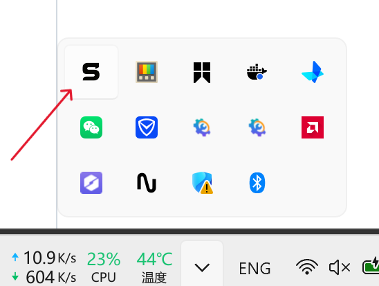
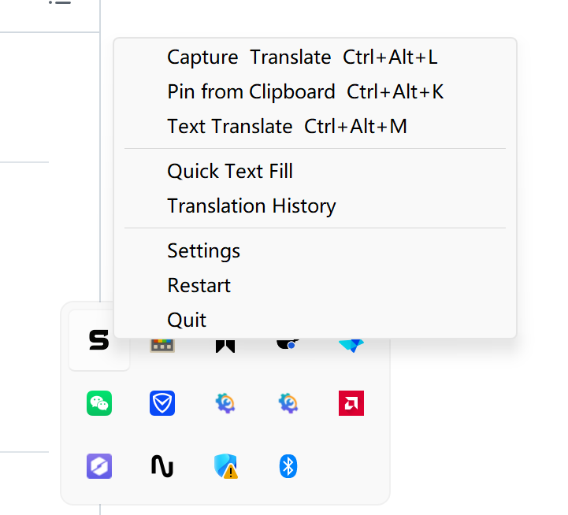

<h1 align="center">SnapTranslate</h1>

<p align="center">
  
</p>

<p align="center">
  
  
  
  
  
  
</p>

<p align="center">
  <a href="README.zh.md">简体中文</a> · <a href="README.zh-TW.md">繁體中文</a> · <a href="README.md">English</a> · <a href="README.ja.md">日本語</a> · <a href="README.ko.md">한국어</a>
</p>

## 簡介

基於 Tauri 2 的桌面螢幕截圖翻譯工具。框選螢幕區域 → 本地 OCR 提取文字 → AI 翻譯 → 右側面板展示結果。不彈窗、不打斷工作流程。支援快捷文字填充，可配置快速鍵與填充文字對應，按下快速鍵自動填充文字到焦點輸入框。

## 截圖展示

<p align="center">
  
</p>

<p align="center">
  
  <br/>
  <em>桌面快捷方式與系統監控</em>
</p>

<p align="center">
  
  <br/>
  <em>右鍵托盤選單</em>
</p>

## 下載安裝

從 [Releases](https://github.com/XuMingKe-06/SanpTranslate/releases) 下載：

| 平台 | 格式 |
|------|------|
| Windows 10+ | `.exe` |
| macOS 12+ | `.dmg` |
| Linux (x86_64) | `.AppImage` |

⚠️ **系統需求：**

- **Windows**：下載即可使用
- **macOS**：macOS 12+，需 WebKit（系統內建），且需透過 Homebrew 安裝 Tesseract 及語言包：
  ```bash
  brew install tesseract tesseract-lang
  ```
- **Linux**：支援 X11/Wayland，需 WebKitGTK，且需安裝 Tesseract 引擎及對應的語言包：
  - **Ubuntu / Debian**：
    ```bash
    sudo apt update
    sudo apt install tesseract-ocr tesseract-ocr-chi-sim tesseract-ocr-eng tesseract-ocr-jpn
    ```
  - **Arch Linux**：
    ```bash
    sudo pacman -S tesseract tesseract-data-chi_sim tesseract-data-eng tesseract-data-jpn
    ```

## 功能特性

- **框選截圖翻譯** — 全域快速鍵 `Ctrl+Alt+L`，拖拽框選任意區域，截圖自動貼在原位
- **剪貼簿貼圖** — `Ctrl+Alt+P` 將剪貼簿圖片貼到桌面翻譯
- **文字翻譯** — `Ctrl+Alt+M` 開啟文字翻譯視窗，`Ctrl+Enter` 快捷翻譯
- **快捷文字填充** — 配置快速鍵與填充文字對應，按下快速鍵自動填充文字到焦點輸入框，支援內建範本（如 Git 工作樹提示詞）
- **本地 OCR** — 內建 Tesseract 離線引擎，支援中文 / 英文 / 日文，可配置源語言或自動偵測
- **AI 翻譯** — 支援 OpenAI 相容 / Anthropic / Gemini API，自備模型與金鑰
- **翻譯快取** — 重複內容自動比對歷史記錄，命中快取跳過 API 呼叫
- **貼圖視窗** — 截圖固定在原始位置，右側譯文面板支援高度拉伸
- **原文/譯文切換** — 一鍵切換原文與翻譯結果
- **一鍵複製** — 複製原文或譯文到剪貼簿
- **翻譯歷史** — 自動儲存到本地 SQLite，支援檢視/複製/刪除/清空
- **多語言介面** — 簡體中文 / English 介面，支援翻譯為中文 / 英語 / 日語 / 韓語 / 法語 / 德語 / 西班牙語 / 俄語，跟隨系統自動切換
- **快捷鍵衝突檢測** — 自動檢測快捷鍵是否被其他程式佔用並發出警告
- **隱私安全** — 截圖全在本地處理，僅翻譯請求與自配 API 通訊，無遙測
- **自動更新** — 啟動時靜默檢查、下載、安裝新版本
- **開機自啟動** — 可選開機自動啟動

## 快速上手

### 1. 配置 AI API

右鍵系統托盤 → **設定**，填入：

- **API 提供商**：OpenAI / Anthropic / Gemini
- **API 地址**：對應提供商的 API 端點
- **API 金鑰**：透過系統憑證管理員安全儲存，不落碟
- **模型名稱**：如 `gpt-4o`、`claude-3-5-sonnet-20241022`、`gemini-2.5-flash`
- **目標語言**：中文、英語、日語、法語等
- **OCR 源語言**：自動偵測 / 中文 / 英文 / 日文

### 2. 常用操作

```
Ctrl+Alt+L  → 框選截圖並貼圖到原位
                   ↓
  點選「翻譯」→ OCR + AI 翻譯，譯文在右側面板展示
                   ↓
  下次相同內容 → 自動命中快取，即刻顯示

Ctrl+Alt+P  → 剪貼簿圖片貼到桌面翻譯
Ctrl+Alt+M  → 開啟文字翻譯視窗
```

### 3. 快捷文字填充

右鍵系統托盤 → **快捷文字填充**，配置快速鍵與填充文字的對應關係：

- 點選「添加條目」建立新的快速鍵對應
- 設定快速鍵和對應的填充文字
- 提供內建範本（如 Git 工作樹提示詞）快速配置
- 當焦點在輸入框時，按下快速鍵即可自動填充文字

### 4. 貼圖視窗操作

| 操作 | 說明 |
|------|------|
| 翻譯 / 重新翻譯 | OCR + AI 翻譯，重新翻譯跳过快取 |
| 複製原文/譯文 | 一鍵複製到剪貼簿 |
| 切換顯示 | 切換原文與譯文 |
| 拖拽 | 視窗標題區（排除按鈕區域） |
| 拉伸面板 | 右側面板邊緣拖拽調整高度 |
| 關閉 | 雙擊圖片區域 |

## 技術棧

| 層級 | 技術 |
|------|------|
| 桌面框架 | Tauri 2.x |
| 前端 | React 18 + TypeScript + Vite 6 |
| UI 元件庫 | Ant Design（深色主題） |
| 後端 | Rust (2024 edition) |
| 狀態管理 | Zustand 5 |
| 路由 | react-router-dom 6 |
| 國際化 | react-i18next + i18next 24 |
| 截圖 | xcap |
| OCR | Tesseract CLI（離線） |
| 翻譯 | reqwest → OpenAI 相容 / Anthropic / Gemini API |
| 資料庫 | SQLite (rusqlite) |
| 安全儲存 | keyring（系統憑證管理員） |

## 從原始碼建構

```bash
git clone https://github.com/light-misty/SanpTranslate.git
cd SnapTranslate
pnpm install
pnpm run tauri dev    # 開發模式 (HMR)
pnpm run tauri build  # 生產建構
```

## 設定檔位置

| 內容 | Windows | macOS | Linux |
|------|---------|-------|-------|
| 設定檔 | `%APPDATA%\SnapTranslate\config\config.toml` | `~/Library/Application Support/SnapTranslate/config/config.toml` | `~/.config/SnapTranslate/config/config.toml` |
| 歷史資料庫 | `%APPDATA%\SnapTranslate\data\history.db` | `~/Library/Application Support/SnapTranslate/data/history.db` | `~/.local/share/SnapTranslate/data/history.db` |

> API 金鑰儲存在系統憑證管理員中，**不儲存在設定檔內**。

## 許可

[MIT License](LICENSE) — Copyright © 2026 SanpTranslate
